# 🎯 COMPREHENSIVE ACTION PLAN - Bal-Con Builders Platform Fixes

## Executive Summary

**Current Status:** B- (79/100) - Strong foundation with critical gaps preventing production launch
**Target Goal:** A (90+/100) - Production-ready, user-friendly platform
**Timeline:** 4-6 weeks with focused sprints
**Team Requirement:** 3-4 developers working in parallel

---

## 🔥 CRITICAL PATH - Must Fix Before ANY User Testing (Week 1)

These are **blockers** that prevent basic functionality and pose security/legal risks:

### Sprint 1A: Infrastructure & Security Fixes (Days 1-3)
**Owner: Senior Backend Developer + DevOps**

| Task | Impact | Risk Level | Time |
|------|---------|------------|------|
| **1. Fix Test Infrastructure** | Can't validate any changes | 🔴 Critical | 4h |
| **2. Security: Move JWT to HttpOnly Cookies** | XSS vulnerability | 🔴 Critical | 8h |
| **3. Fix Duplicate Main Element Bug** | Accessibility violation | 🔴 Critical | 2h |
| **4. Production Security: CORS and CSP** | Production vulnerability | 🔴 Critical | 6h |

**Deliverables:**
- ✅ `npm run test:backend` works without errors
- ✅ JWT stored securely in httpOnly cookies
- ✅ Single `<main>` element per page
- ✅ Production-ready security headers

**Acceptance Criteria:**
```bash
# Tests must pass
npm run test:backend
# Should show: "Tests: X passed, Y total"

# Security headers check
curl -I https://staging-url.railway.app
# Should include: Content-Security-Policy, X-Frame-Options, etc.
```

### Sprint 1B: Data Layer Fixes (Days 2-4)
**Owner: Full-Stack Developer**

| Task | Impact | Risk Level | Time |
|------|---------|------------|------|
| **5. Replace All Mock Data with API Integration** | Fake data in production | 🟠 High | 16h |
| **6. Database Migration Testing** | Data loss risk | 🟠 High | 8h |

**Deliverables:**
- ✅ All dashboard components fetch real data from backend
- ✅ Loading states and error handling for all API calls
- ✅ Migration rollback procedures documented

---

## 🎨 UI/UX CRITICAL FIXES (Week 2)

User experience issues that would cause immediate confusion and abandonment:

### Sprint 2A: Navigation Overhaul (Days 5-7)
**Owner: Frontend Lead + UI/UX Designer**

| Task | Impact | Risk Level | Time |
|------|---------|------------|------|
| **7. Navigation Redesign: Implement Mini Sidebar** | User confusion | 🟠 High | 12h |
| **8. Remove BC Builders Right Panel** | Wasted screen space | 🟡 Medium | 4h |
| **9. Simplify AppBar: Remove Clutter** | Cognitive overload | 🟡 Medium | 6h |
| **10. Theme Consistency: Fix Color Palette** | Brand mismatch | 🟡 Medium | 3h |

**Deliverables:**
- ✅ Persistent mini sidebar (64px) with hover-to-expand
- ✅ Full-width content area (remove right panel)
- ✅ Clean top bar with 4 items max
- ✅ Brand colors matching documentation

### Sprint 2B: Essential UX Improvements (Days 6-8)
**Owner: Frontend Developer**

| Task | Impact | Risk Level | Time |
|------|---------|------------|------|
| **11. Login UX: Add Real-time Validation** | First impression | 🟠 High | 8h |
| **12. Error Boundaries: Add Comprehensive Error Handling** | App crashes | 🟠 High | 6h |
| **13. Create Settings Page** | Hidden functionality | 🟡 Medium | 8h |

**Deliverables:**
- ✅ Email/password validation with helpful error messages
- ✅ ErrorBoundary wrapping all routes
- ✅ Settings page for system health, density, preferences

---

## 📱 PLATFORM COMPLETION (Week 3)

Features that make the platform feel modern and complete:

### Sprint 3A: Search & Mobile (Days 9-11)
**Owner: Frontend Developer + Mobile Specialist**

| Task | Impact | Risk Level | Time |
|------|---------|------------|------|
| **14. Add Global Search to AppBar** | User productivity | 🟡 Medium | 12h |
| **15. Mobile: Add Bottom Navigation** | Mobile usability | 🟡 Medium | 8h |
| **16. Accessibility Audit: WCAG Compliance** | Legal compliance | 🟡 Medium | 10h |

**Deliverables:**
- ✅ Global search bar searching projects, quotes, customers
- ✅ Mobile bottom navigation with 5 primary actions
- ✅ WCAG AA compliance (color contrast, aria-labels, keyboard nav)

### Sprint 3B: Code Quality (Days 10-12)
**Owner: Tech Lead**

| Task | Impact | Risk Level | Time |
|------|---------|------------|------|
| **17. Code Cleanup: Remove Duplicates** | Maintainability | 🟢 Low | 6h |
| **18. Frontend Test Suite Revival** | Quality assurance | 🟡 Medium | 12h |

**Deliverables:**
- ✅ Remove duplicate Login components and old files
- ✅ Frontend tests passing with 60%+ coverage

---

## 🧪 TESTING & OPTIMIZATION (Week 4)

Ensuring production readiness and performance:

### Sprint 4A: Automated Testing (Days 13-15)
**Owner: QA Engineer + Developer**

| Task | Impact | Risk Level | Time |
|------|---------|------------|------|
| **19. E2E Testing Setup with Playwright** | Regression prevention | 🟡 Medium | 16h |
| **20. Performance Optimization** | User experience | 🟢 Low | 12h |

**Deliverables:**
- ✅ Playwright tests for critical user flows
- ✅ Bundle optimization and lazy loading
- ✅ Performance baseline established

---

## 🎯 SPRINT BREAKDOWN WITH DEPENDENCIES

```mermaid
gantt
    title Bal-Con Builders Fix Timeline
    dateFormat  X
    axisFormat %d

    section Week 1 - Critical
    Test Infrastructure     :crit, done, 0, 1
    Security Fixes         :crit, active, 0, 2
    Mock Data → API        :2, 4
    Database Testing       :3, 4

    section Week 2 - UX
    Mini Sidebar          :5, 7
    Theme Fixes           :5, 6
    Login UX              :6, 8
    Error Boundaries      :7, 8

    section Week 3 - Polish
    Global Search         :9, 11
    Mobile Nav            :9, 11
    Accessibility         :10, 12
    Code Cleanup          :10, 11

    section Week 4 - Testing
    E2E Tests            :13, 15
    Performance          :14, 16
```



---

## 📋 DAILY STANDUP STRUCTURE

### Daily Questions:
1. **Blockers:** What's preventing you from completing your task?
2. **Dependencies:** Are you waiting on another team member?
3. **Testing:** How will we validate this fix works?
4. **User Impact:** How does this improve the user experience?

### Weekly Reviews:
- **Monday:** Sprint planning + task assignment
- **Wednesday:** Mid-sprint check-in + blocker resolution
- **Friday:** Demo completed features + retrospective

---

## 🛠️ TECHNICAL IMPLEMENTATION STRATEGY

### Branching Strategy:
```bash
# Feature branches for each major fix
git checkout -b fix/test-infrastructure
git checkout -b fix/jwt-security  
git checkout -b feat/mini-sidebar
git checkout -b feat/global-search
```

### Testing Strategy:
```bash
# Each PR must pass:
1. npm run test:backend (fixed in Sprint 1A)
2. npm run test:frontend (revived in Sprint 3B)  
3. npm run build (no TypeScript errors)
4. Lighthouse score >90 (performance)
5. Manual testing on mobile + desktop
```

### Code Review Process:
- **Security changes:** 2 approvals required
- **UI changes:** Designer + Developer approval
- **API changes:** Backend lead approval
- **All changes:** Automated tests must pass

---

## 🎯 SUCCESS METRICS

### Week 1 Targets:
- [ ] Test coverage >60% (backend)
- [ ] Zero security vulnerabilities in scan
- [ ] All dashboards show real data
- [ ] Zero accessibility violations (critical)

### Week 2 Targets:
- [ ] Navigation task completion 50% faster
- [ ] Login error rate <5%
- [ ] Mobile usability score >80
- [ ] Zero console errors on any page

### Week 3 Targets:
- [ ] Search finds relevant results in <2 seconds
- [ ] Mobile bottom nav adoption >80%
- [ ] WCAG AA compliance 100%
- [ ] Bundle size <2MB

### Week 4 Targets:
- [ ] E2E test coverage for 5 critical flows
- [ ] Page load time <3 seconds
- [ ] Performance score >90 on all pages

---

## 💰 RESOURCE ALLOCATION

### Team Structure (Recommended):
```
Week 1-2: All hands on critical fixes
├── Senior Backend Dev (Security + Infrastructure)  
├── Full-Stack Dev (API Integration + Database)
├── Frontend Lead (Navigation + UI Components)
└── UI/UX Designer (Theme + User Experience)

Week 3-4: Specialized work
├── Mobile Specialist (Bottom nav + Responsive)
├── QA Engineer (E2E tests + Manual testing)
├── Performance Engineer (Optimization)  
└── Accessibility Specialist (WCAG compliance)
```

### Budget Impact:
- **Option A:** Fix internally (4 weeks, existing team)
- **Option B:** Hire contractor for critical fixes (2 weeks, $15-25k)
- **Option C:** Hybrid approach (contractors for UI, internal for backend)

**Recommendation:** Option A with clear sprint structure

---

## 🚨 RISK MITIGATION

### High-Risk Items:
| Risk | Probability | Impact | Mitigation |
|------|-------------|--------|------------|
| **Security changes break login** | Medium | High | Feature flags + rollback plan |
| **Navigation redesign confuses users** | Low | High | A/B test old vs new |
| **API integration causes data loss** | Low | Critical | Database backups + staging tests |
| **Timeline slips due to scope creep** | High | Medium | Strict sprint boundaries |

### Rollback Plans:
```javascript
// Feature flags for major changes
const useNewNavigation = process.env.REACT_APP_NEW_NAV === 'true';
const useSecureCookies = process.env.SECURE_AUTH === 'true';

// Database migration rollback scripts ready
npm run migrate:down -- --to 2024-10-15
```

---

## 📊 BEFORE vs AFTER COMPARISON

### Current State (Week 0):
- ❌ Tests don't run (`ts-node` missing)
- ❌ JWT in localStorage (security risk)  
- ❌ All mock data (fake experience)
- ❌ Confusing navigation (2-panel layout)
- ❌ 7 items in toolbar (overwhelming)
- ❌ No mobile bottom nav
- ❌ Theme doesn't match docs
- ❌ No global search
- ❌ No error boundaries

### Target State (Week 4):
- ✅ Full test suite with >60% coverage
- ✅ Secure httpOnly cookie authentication
- ✅ Real-time data from backend APIs
- ✅ Modern mini-sidebar navigation
- ✅ Clean 4-item toolbar
- ✅ Mobile-first bottom navigation  
- ✅ Brand-consistent theme
- ✅ Platform-wide search functionality
- ✅ Graceful error handling

**Quality Score:** 79/100 → 92/100 (A- grade)

---

## 🎬 NEXT STEPS - Starting Monday

### Week 1 Sprint Planning (Monday 9 AM):
1. **Assign owners** to each critical task
2. **Set up project board** (GitHub Projects or Jira)
3. **Create feature branches** for parallel work
4. **Define "Definition of Done"** for each task

### Immediate Actions (Today):
1. **Install missing dependencies:**
   ```bash
   cd backend
   npm install ts-node @types/node --save-dev
   npm run test
   ```

2. **Create feature flag system:**
   ```javascript
   // Add to .env files
   REACT_APP_NEW_NAVIGATION=false
   REACT_APP_SECURE_AUTH=false
   ```

3. **Set up staging environment:**
   ```bash
   # Deploy current version to staging
   # Test all identified issues
   # Document current behavior
   ```

### Ready to Start? 
**Priority 1:** Fix test infrastructure (blocks everything else)
**Priority 2:** Security fixes (JWT cookies, CORS)
**Priority 3:** Navigation redesign (biggest UX impact)

---

**Let's ship a production-ready platform in 4 weeks! 🚀**

*Questions? Need clarification on any task? Ready to start with Priority 1?*